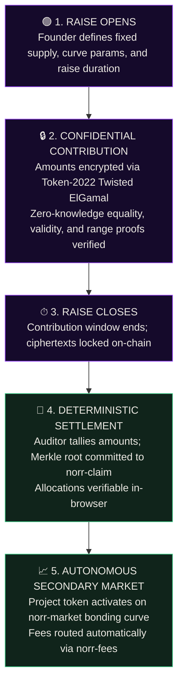
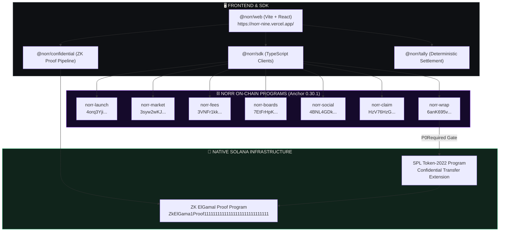

# Norr

**Private contribution. Public settlement.**

Norr is a capital formation and trading protocol built natively on Solana. It enables founders to raise funds with confidential contribution amounts using Token-2022 and zero-knowledge ElGamal proofs, followed by deterministic on-chain settlement and autonomous secondary markets.

Live Web Application: [https://norr-nine.vercel.app/](https://norr-nine.vercel.app/)  
Target Cluster: **Solana Devnet**


🎬 **Demo Video:** [`norr-demo.mp4`](norr-demo.mp4) — A complete walkthrough of the live web product, Devnet programs, and the confidential transfer verification pipeline.

---

## What is Norr?

Norr is an on-chain capital formation platform where **contribution amounts remain encrypted** while a launch is active, and **settlement is mathematically verifiable** the moment the round closes.

Traditional token launches force a choice between two bad options:
1. **Fully public launches**, which leak investment sizes, invite MEV front-running, and reveal whale positions.
2. **Centralized private sales**, which rely on opaque spreadsheets, trusted custodians, and unverifiable token distribution.

Norr provides privacy during capital formation and mathematical proof at settlement.

---

## Why Norr?

| Feature | Standard Launchpads | Norr Protocol |
| :--- | :--- | :--- |
| **Amount Privacy** | Public transactions; wallet sizes and orders exposed in real time. | **Token-2022 Confidential Transfers**; Twisted ElGamal ciphertexts with ZK range & validity proofs. |
| **Settlement** | Operator database or manual distribution; trust the spreadsheet. | **Deterministic Merkle Root**; computed client-side and verified by on-chain smart contracts. |
| **Secondary Market** | Manual liquidity pool creation after round close; rug pull risks. | **Autonomous Constant-Product Bonding Curve** (`norr-market`) with automated fee routing. |
| **Curation & Community** | Discretionary influencer deals and opaque kickbacks. | **Decentralized Curation Desks** (`norr-boards`) with immutable fee snapshots. |
| **Security Posture** | Marketing claims masquerading as production readiness. | **Fail-closed `P0Required` gate** on private paths pending external independent review. |

---

## Product

- **Sealed Raises**: Fixed-supply token launches where contribution amounts are encrypted under Token-2022.
- **Instant Markets**: Immediate token trading on an autonomous constant-product bonding curve against USDC.
- **Curator Desks**: Community-operated curation boards where curators snapshot minimum fee shares and coordinate discussions on-chain.
- **Automated Fee Routing**: Immutable split contracts that distribute trade and launch fees directly to creators, desks, and treasury.
- **Merkle Claims & Refunds**: Transparent allocation claims and automated timelock disaster refunds.

---

## How It Works



Norr is **not a mixer**. Contributor wallet identities, deposit timing, aggregate raise totals, and claim transactions are always public. Only individual contribution amounts are encrypted, and only while the raise is actively accepting funds.

---

## Architecture



---

## Solana Programs

All seven Norr Anchor programs are deployed and executable on **Solana Devnet**:

| Program | Devnet Address | Purpose | Status |
| :--- | :--- | :--- | :--- |
| `norr-launch` | `4orq3YjidamefZgGufp6uSpdgxdxpNeCfdy6spZas2cE` | Token launch lifecycle, parameters, and metadata | **DEVNET VERIFIED** |
| `norr-claim` | `HzV76HzGKqDuhmc2f5VoMDEF3tqo3GYGbMGbYyRYWitg` | Merkle-proof allocation claims and disaster refunds | **DEVNET VERIFIED** |
| `norr-fees` | `3VNFr1kkLv1mQkpWQSNBJhDJbpLsELPPF7f5YMWHjMy8` | Exact fee routing and pro-rata revenue distributions | **DEVNET VERIFIED** |
| `norr-market` | `3syw2wKJNu1TCGArkvnZHvJ8xN9mn5oHdr34yrpJdyXB` | Constant-product bonding curve and secondary trading | **DEVNET VERIFIED** |
| `norr-boards` | `7EtFrHpKzvKYYWYNqimJu8t4UEmDgxTvwyqnGhcuAenB` | Curation desks, curator minimum share, and allowlists | **DEVNET VERIFIED** |
| `norr-social` | `4BNL4GDkUFkCdVZTXo9e3KYRDsD32DXdcrTYJXiucs7g` | On-chain discussions, profiles, and coordination | **DEVNET VERIFIED** |
| `norr-wrap` | `6anK695vF91cd3r2iin9AMRQzWCfJL6sugZywdfj9cdV` | Confidential token wrapping & unwrapping boundary | **DEVNET VERIFIED** |

---

## Confidential Contributions

Norr leverages Solana's native **SPL Token-2022 Confidential Transfer Extension**:
- **Twisted ElGamal Encryption**: Contributor balances are stored as ElGamal ciphertexts over the Curve25519 Ristretto group.
- **Zero-Knowledge Proofs**: Every private balance transfer submits equality, validity (3-handles), and 128-bit range proofs verified directly by the native ZK ElGamal Proof Program.
- **Auditor Encryption**: Transfers encrypt amounts under the tally authority's public key, enabling transparent balance decryption without granting spending authority.
- **Deterministic Key Derivation (ADR-010)**: User encryption keys derive deterministically via `PBKDF2-HMAC-SHA256` from a single wallet signature. No private keys or mnemonics are stored.

### Verification Status & P0 Gate
- **Lifecycle Steps 1–8**: Fully verified on canonical Solana Devnet (Mint initialization, account configuration, ZK proof generation, confidential deposit, apply pending, confidential transfer, destination apply, and confidential withdraw).
- **P0 Audit Gate**: Norr enforces `P0Required` on private wrap and contribution paths until two independent human cryptographic reviewers sign off on `p0-report.json`.
- **Mainnet Readiness**: Mainnet confidential support is not claimed until Solana validators activate native Token-2022 zk-ops on Mainnet-Beta.

---

## Devnet State & Capabilities

Real, confirmed Devnet transactions powering the Norr demo:

| Operation | Target Object | Transaction Signature / Evidence |
| :--- | :--- | :--- |
| **Curation Desk Init** | `GurRuFuc94...` | [`5M9jaPCe...`](https://explorer.solana.com/tx/5M9jaPCesoaQH4ZCqTT3KS19doyZR3US3THgvHJNG4ZmYtg1mcNhZjGXi4BM9ZFtHwct4aeXv9qGhSxzMLk7Yf4h?cluster=devnet) |
| **Social Thread & Comment** | `DYEPVp7y...` | [`G8JvtTfY...`](https://explorer.solana.com/tx/G8JvtTfYfwBpGXCuxs8WyP4xzv2dPxoWqpnb2ZBX1F1jXq1gJQJGMZ1rtY7vj4uyMjwzHQ7sVmaie1wjnqTTFcr?cluster=devnet) |
| **Fee Router Init** | `fwPLJDmr...` | [`5XPvXCoG...`](https://explorer.solana.com/tx/5XPvXCoGmmYmVxhRPAjiHQm4Cyv45yQZUj44Nn9vEQ3MbwFuD1NTdvmxcM3owmpSKZ81nYzsCevCLkXj5ioSintu?cluster=devnet) |
| **Token Launch Init** | `CjJ4Tzea...` | [`267NK6jY...`](https://explorer.solana.com/tx/267NK6jYH2C47AJN6JwRRKMAsFdA34sktCmT8GY5uPZTqrjC2W1ugD3zCVZpmKXMFWLcYJHXe2TqEtJuMvqtBM1r?cluster=devnet) |
| **Settlement Merkle Root** | `3USZayAh...` | [`3RbwJbgC...`](https://explorer.solana.com/tx/3RbwJbgCJKhBvJfxdxXK5EPNsxxLwV2Umkf5qGLtorRAdkXAr9n38dAkY1pVLWtzXWTEpEp8wtK8n4V27PYPHA16?cluster=devnet) |
| **Disaster Refund Commit** | `7iL2YS9L...` | [`5JydsTsC...`](https://explorer.solana.com/tx/5JydsTsCXAKrtL7MxUUSsubPEmS6H8LzbGHx3GRDECKYYkrfhtK4rZKCeytNUdeV43GHZHJku6EHeKtNmm2w8a2E?cluster=devnet) |
| **Confidential Transfer** | `3N8KkTcA...` | [`2KiygxE9...`](https://explorer.solana.com/tx/2KiygxE9dJX2egQcd1DGywYuZysUSbcYVVXSwLwB3fEuN2PQh5ZMwTk8ViRqwATTTFSs3sH8uiNdzAurJKJzTSZ7?cluster=devnet) |

---

## Security

1. **Deterministic Invariant Checks**: Automated tests verify that curve reserves, fee distributions, and double-keccak Merkle trees cannot cross domains or suffer rounding losses.
2. **Fail-Closed Design**: If proof context accounts or audit conditions fail, transactions revert immediately without state corruption.
3. **Zero Secret Persistence**: Private keys and ElGamal decryption scalars are never persisted to localStorage, indexers, logs, or analytics.
4. **Automated Secret Scanning**: Pre-commit CI gates run `scripts/secret-scan.py` to prevent key leakage.

---

## Getting Started

### Prerequisites
- Node.js >= 20.0.0
- pnpm >= 9.0.0
- Rust >= 1.79.0 & Solana CLI >= 1.18.0

### Installation
```bash
git clone https://github.com/ShrikarT/norr.git
cd norr
pnpm install
```

---

## Development

```bash
# Build all packages and web app
pnpm -r build

# Run local web development server
pnpm --filter @norr/web dev
```

---

## Testing

Run the complete 8-point verification pipeline:
```bash
# Workspace unit and integration tests
pnpm -r test

# TypeScript typechecking
pnpm -r typecheck

# Mathematical invariant checks
node --import tsx --test tests/invariants.test.ts

# Program ID consistency verification
node --import tsx --test tests/program-ids-consistency.test.ts

# Secret scan
python3 scripts/secret-scan.py

# Rust formatting and clippy
cargo fmt --all -- --check
cargo clippy --workspace --all-targets --all-features -- -D warnings
cargo check --workspace
```

---


## Known Limitations

1. **Mainnet Confidential Feature Gate**: Native Token-2022 confidential transfer instructions are active on Devnet; mainnet activation awaits final Solana validator consensus feature activation.
2. **ZK Proof Generation Environment**: In-browser ZK proof compilation requires WebAssembly curve25519 bindings; production proof generation currently utilizes the native CLI tool (`tools/ct-proof-gen`).
3. **P0 Reviewer Signatures**: Private token wrapping remains locked under `P0Required` until two external independent security auditors submit cryptographic attestations.

---

*Norr is open-source protocol infrastructure built for the Solana ecosystem.*
