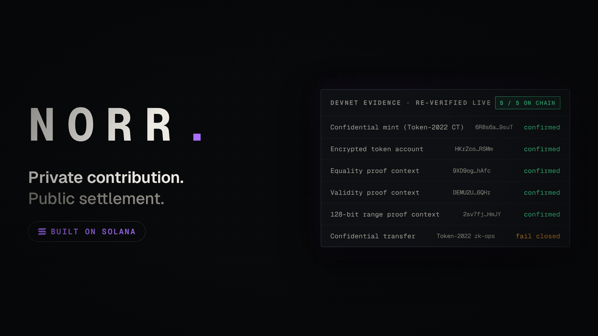
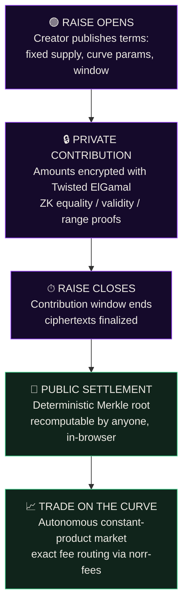
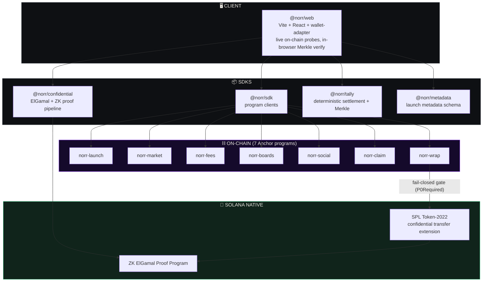
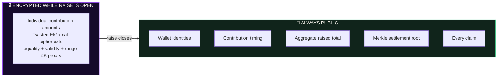
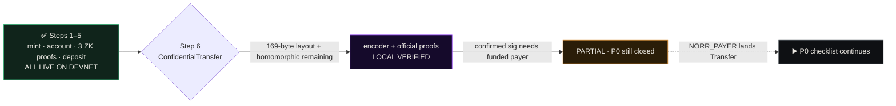

# 🌌 Norr

**Private contribution. Public settlement.**

Norr is a Solana-native token launch protocol where contribution amounts stay encrypted while a raise is open, and every settlement is publicly verifiable the moment it closes.

> Every launchpad asks you to trust its spreadsheet. Norr asks you to verify a Merkle root.

Live against **Solana Devnet** — every claim in the app is probed on-chain in your browser, and everything that cannot be proven is honestly gated.



🎬 **Demo:** [`norr-demo.mp4`](norr-demo.mp4) — a ~2 minute walkthrough of the product, the live Devnet evidence, and the honestly gated confidential transfer boundary.

---

## 📖 Table of Contents

1. [The Problem](#-the-problem)
2. [The Honesty Stack](#-the-honesty-stack)
3. [Lifecycle](#-lifecycle)
4. [Architecture](#-architecture)
5. [Repository Structure](#-repository-structure)
6. [The Seven Programs](#-the-seven-programs)
7. [Privacy Model](#-privacy-model)
8. [Devnet Evidence](#-devnet-evidence)
9. [The Capability Boundary](#-the-capability-boundary)
10. [The Web App](#-the-web-app)
11. [Local Development Setup](#-local-development-setup)
12. [Demo Walkthrough](#-demo-walkthrough)
13. [Roadmap](#-roadmap)

---

## 🎯 The Problem

On-chain capital formation leaks information at exactly the moment it matters most. Three failures repeat on every public launchpad:

1. **Front running.** Public contribution transactions let bots copy-trade and snipe allocations before the raise even closes.
2. **Size signaling.** Visible contribution amounts reveal whale intent, distorting price discovery before trading begins.
3. **Unverifiable settlement.** When the raise closes, allocations come from an operator's database. You cannot audit a spreadsheet you cannot see.

**Norr's answer:** encrypt the amounts while the raise is open, then settle everything into a publicly recomputable Merkle root and an autonomous bonding curve. Privacy during formation. Proof at settlement. Nothing in between requires trust.

---

## 🏛 The Honesty Stack

| Layer | Everyone else | Norr |
|---|---|---|
| **Amount privacy** | Public contribution transactions; whales are tracked in real time | SPL Token-2022 confidential transfers — Twisted ElGamal ciphertexts, ZK-proved, amounts encrypted while the raise is open |
| **Settlement** | Operator database decides allocations; trust the spreadsheet | Deterministic Merkle root anyone can recompute from public inputs, verified in your own browser |
| **Market** | Manual liquidity deployment after the raise; rug window | Settlement flows directly into an autonomous constant-product curve (`norr-market`) with exact fee routing |
| **Capability truth** | Demos fake the parts that don't work yet | Fail-closed `P0Required` gate: any path that cannot be proven on-chain refuses to execute and shows you the real error |

---

## 🔄 Lifecycle



Norr is **not a mixer**. Wallet identities, contribution timing, the aggregate raised total, the Merkle root, and every claim are always public. Only the *individual amounts* are encrypted, and only *while the raise is open*. At settlement, allocations become fully auditable.

---

## 🏗 Architecture



**Why seven programs?** Each program owns one irreversible concern — raising, trading, fee routing, curation, social threads, claiming, and confidential wrapping — so each can be audited, frozen, and eventually made immutable independently. A monolith would force the riskiest code (confidential wrap) to share an upgrade authority with the code holding user funds (market, claim).

---

## 📁 Repository Structure

```
norr/
├── programs/                  # 7 Anchor programs (Rust)
│   ├── norr-launch/           #   raise lifecycle + terms
│   ├── norr-market/           #   constant-product bonding curve
│   ├── norr-fees/             #   exact fee routing
│   ├── norr-boards/           #   desk curation
│   ├── norr-social/           #   on-chain threads
│   ├── norr-claim/            #   Merkle-proof claims
│   └── norr-wrap/             #   confidential wrap (fail-closed gated)
├── packages/                  # TypeScript SDKs
│   ├── sdk/                   #   @norr/sdk — program clients
│   ├── confidential/          #   @norr/confidential — ElGamal + ZK pipeline
│   ├── tally/                 #   @norr/tally — settlement + Merkle
│   └── metadata/              #   @norr/metadata — launch metadata
├── apps/
│   ├── web/                   #   @norr/web — the app (Vite + React)
│   ├── indexer/               #   rebuildable history indexer
│   └── cli/                   #   operator CLI
├── scripts/                   # devnet drills, secret scan
├── tests/                     # invariants + integration tests
├── docs/                      # audits, privacy model, demo script
├── norr-demo.mp4              # 🎬 product demo
└── norr-demo-thumbnail.png
```

---

## ⚙️ The Seven Programs

Declared program IDs below. The web app **probes deployment live** — it never claims a program is deployed unless the cluster says so.

| Program | Concern | Declared ID |
|---|---|---|
| `norr-launch` | Raise lifecycle, terms, contribution window | `4cpxPRvPm974bLKMJa8TfYyvzuFeQ9sjtFJkz3EhJ4p8` |
| `norr-market` | Constant-product bonding curve | `Gx4szwkK1wMYpyZJ6y168ytuPNfC3gq9kehg3XjgMNkV` |
| `norr-fees` | Exact fee routing and distribution | `6qXW6K7UxDmzxotm8XM5uqWiqF6hBokMdkGavbw5Mp6J` |
| `norr-boards` | Desk curation economy | `2CfmqDruJHpAqManNjNAfEhCX99NhBAkmCQ73Tt5FXvY` |
| `norr-social` | On-chain coordination threads | `95naDaDALhhL37JseHMkJFeUqPs8ucNYcaSwZCknScAw` |
| `norr-claim` | Merkle-proof allocation claims | `4QrYBhxu8crT4Yi33XR6DqQEp1XG52R94rBzgx8QdF9R` |
| `norr-wrap` | Confidential wrap boundary (gated) | `9qLPCBzMENxbTVvFQCACtfD9DnY1KBhz3WFqMzc8u7LU` |

---

## 🔐 Privacy Model



- **Not a mixer.** Who participated and when is always visible. Only *how much* is hidden, and only *temporarily*.
- **No custody games.** Funds live in program-owned accounts governed by on-chain rules, not operator wallets.
- **Escape hatch.** If the confidential pipeline is unavailable, the raise refuses to pretend — it fails closed rather than fake privacy.
- **No invented figures.** The app never renders a number it cannot recompute or fetch from the cluster.

---

## 🧾 Devnet Evidence

The confidential transfer pipeline was drilled end-to-end on Solana Devnet. Steps 1–5 are real, on-chain, and verifiable right now:

| # | Artifact | Address / Signature |
|---|---|---|
| 1 | Token-2022 mint with confidential transfer extension | [`6RBs6aoEpQZ59aKfpqWE2SnAX3cysBo3whFuhBoe9suT`](https://explorer.solana.com/address/6RBs6aoEpQZ59aKfpqWE2SnAX3cysBo3whFuhBoe9suT?cluster=devnet) |
| 2 | Configured confidential token account | [`HKrZcotGz9MCJz1yLzBq4Cd6mYFViNb8iCgtY3gTRSMm`](https://explorer.solana.com/address/HKrZcotGz9MCJz1yLzBq4Cd6mYFViNb8iCgtY3gTRSMm?cluster=devnet) |
| 3 | Equality proof context account | [`9XD9og7ZUCsQNrxjGfTnhndha2eNF4gsGPrNqY8RhAfc`](https://explorer.solana.com/address/9XD9og7ZUCsQNrxjGfTnhndha2eNF4gsGPrNqY8RhAfc?cluster=devnet) |
| 4 | Validity proof context account | [`DEMU2UL3CWpkg9b1M9UktKeuPj9tr5d4QPnoGp1q6QHr`](https://explorer.solana.com/address/DEMU2UL3CWpkg9b1M9UktKeuPj9tr5d4QPnoGp1q6QHr?cluster=devnet) |
| 5 | Range proof context account | [`2sv7fjxXD4YtEu4KeVknL8wUuKTXXgBovXm342qCHmJY`](https://explorer.solana.com/address/2sv7fjxXD4YtEu4KeVknL8wUuKTXXgBovXm342qCHmJY?cluster=devnet) |
| 6 | Confidential deposit transaction | [`3P2SdA…1cf3c`](https://explorer.solana.com/tx/3P2SdAFiifSFve3Vope6dVEb1bNjxyrXbhNaBpJ5AYiv1rm1XHRPB2KxPxSpzioPSHgqeuDkt6odQsBndrp1cf3c?cluster=devnet) |

The landing page probes all five accounts live from your browser and shows a **5 / 5 artifacts** readout — no cached claims. Full breakdown: [`docs/p0-phase3-audit.md`](docs/p0-phase3-audit.md).

---

## 🚧 The Capability Boundary

Canonical Devnet Token-2022 **does** execute `ConfidentialTransferInstruction::Transfer` (zk-ops is in the May 2026 binary). Step 6 is not “compiled out”. The two real failures were:

1. **41-byte encoder** — `@solana-program/token-2022@0.4.2` omitted auditor ciphertexts. Official `TransferInstructionData` is **169 bytes**. Decode failure logged as `InvalidInstructionData`.
2. **Balance mismatch (0x1b)** — `process_source_for_transfer` requires `subtract_with_lo_hi(available, ct_lo[0], ct_hi[0]) == equality_proof.ciphertext`. Dummy / stale proof contexts fail that equality.

Norr still fail-closes: **if the chain cannot prove a confidential transfer, Norr will not show one.** Wrap/claim stay behind `P0Required` until a confirmed Transfer signature exists. See [`docs/PHASE3_REPORT.md`](docs/PHASE3_REPORT.md) and [`docs/p0-phase3-reinvestigation.md`](docs/p0-phase3-reinvestigation.md).



---

## 🖥 The Web App

- **Live everywhere.** Cluster slot, program deployment, and CT evidence are probed on-chain in your browser — the UI never asserts what it hasn't verified.
- **Exact quoting.** Curve quotes use the same integer arithmetic as the programs; no float drift between preview and execution.
- **Browser-local Merkle.** Settlement roots are recomputed client-side so you never have to trust a server's answer.
- **No fake success.** Gated paths show the real cluster error, not a spinner that lies.

| Route | Surface |
|---|---|
| `/` | Landing — live cluster readout + devnet evidence |
| `/launches` | Launch feed |
| `/raise/:sale` | Raise detail — contribute, quote, settle |
| `/start`, `/start/:mode` | Create a launch |
| `/desks`, `/desk/:slug` | Curation desks |
| `/portfolio` | Positions |
| `/activity` | Activity feed |
| `/owed` | Claimable allocations |
| `/private` | Confidential transfer evidence + capability boundary |
| `/compare` | Launch comparison |
| `/settings` | RPC + preferences |

---

## 🛠 Local Development Setup

**Prerequisites:** Node 22 (or 20), pnpm 9+, Python 3.10+.

```bash
# install
pnpm install

# build every package + the app
pnpm -r build

# run the full test suite
pnpm -r test

# protocol invariants
node --import tsx --test tests/invariants.test.ts

# secret scan (CI gate)
python scripts/secret-scan.py

# run the web app
pnpm --filter @norr/web dev
```

Open the printed URL — the landing readout should connect to Devnet and show the live slot plus the **5 / 5 artifacts** evidence probe, computed by your own browser. Production build and hosting notes: [`DEPLOYMENT.md`](DEPLOYMENT.md).

---

## 🎬 Demo Walkthrough

What [`norr-demo.mp4`](norr-demo.mp4) shows, in order:

1. **Landing readout** — live Devnet slot and evidence probes resolving in real time.
2. **Launch feed** — curve state, progress, and pricing computed from on-chain-exact math.
3. **Quote** — integer-exact buy/sell quoting with fee breakdown.
4. **Merkle verify** — settlement root recomputed in the browser and matched.
5. **`/private`** — the five live Devnet artifacts, then the honestly gated Step 6 (169-byte layout, balance-mismatch equality, P0 still closed).

---

## 🗺 Roadmap

1. **Deploy the seven Anchor programs** to Devnet with verified builds and published IDLs.
2. **Land a confirmed ConfidentialTransfer** with `NORR_PAYER` + `scripts/run-p0-step6.ts` — zero architecture changes.
3. **Complete P0 acceptance drills** on the target cluster and unlock the `P0Required` paths.
4. **Market maturity** — locked-liquidity graduation, indexer-backed history, desk curation economy.
5. **Immutability handover** for `norr-claim`, `norr-fees`, `norr-market`, and `norr-wrap` before uncapped mainnet value.

---

**Docs:** [`docs/PHASE3_REPORT.md`](docs/PHASE3_REPORT.md) · [`docs/p0-phase3-reinvestigation.md`](docs/p0-phase3-reinvestigation.md) · [`docs/p0-phase3-audit.md`](docs/p0-phase3-audit.md) · [`docs/confidential-transfers.md`](docs/confidential-transfers.md) · [`DEPLOYMENT.md`](DEPLOYMENT.md)

*Norr currently targets Solana Devnet. Nothing here is financial advice, and no mainnet deployment exists yet.*
