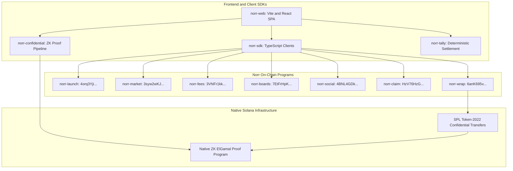

# Norr Protocol — Architecture & State Machine Specification

Norr is an on-chain capital formation and trading protocol designed for Solana. It is composed of 7 independent Anchor programs, client SDKs, and native Solana Token-2022 confidential transfer extensions.

---

## 1. System Architecture

---

## 2. On-Chain Programs

### 1. `norr-launch`
- **Address**: `4orq3YjidamefZgGufp6uSpdgxdxpNeCfdy6spZas2cE`
- **Concern**: Launch lifecycle management, metadata validation, board attachment CPIs, and activation checklists.
- **Seeds**: `[b"launch", project_mint.key().as_ref()]`

### 2. `norr-market`
- **Address**: `3syw2wKJNu1TCGArkvnZHvJ8xN9mn5oHdr34yrpJdyXB`
- **Concern**: Constant-product bonding curve (`x * y = k`) against USDC. Integer ceiling division arithmetic, slippage protection, and automated fee accrual.
- **Seeds**: `[b"curve", project_mint.key().as_ref()]`

### 3. `norr-fees`
- **Address**: `3VNFr1kkLv1mQkpWQSNBJhDJbpLsELPPF7f5YMWHjMy8`
- **Concern**: Exact basis points fee routing. Remainder preservation to primary recipient, zero-dust accounting, and permissionless batch releases.
- **Seeds**: `[b"router", launch.key().as_ref()]`

### 4. `norr-boards`
- **Address**: `7EtFrHpKzvKYYWYNqimJu8t4UEmDgxTvwyqnGhcuAenB`
- **Concern**: Curation desks. Curators snapshot minimum fee shares and maintain creator allowlists.
- **Seeds**: `[b"board", slug.as_bytes()]`

### 5. `norr-social`
- **Address**: `4BNL4GDkUFkCdVZTXo9e3KYRDsD32DXdcrTYJXiucs7g`
- **Concern**: On-chain discussion trees, signed comments, and user coordination profiles.
- **Seeds**: `[b"thread", subject.as_ref()]`, `[b"comment", thread.as_ref(), index.to_le_bytes()]`

### 6. `norr-claim`
- **Address**: `HzV76HzGKqDuhmc2f5VoMDEF3tqo3GYGbMGbYyRYWitg`
- **Concern**: Merkle tree allocation verification (`double-keccak`), allocation claims, and timelocked disaster refunds.
- **Seeds**: `[b"sale", launch.key().as_ref()]`

### 7. `norr-wrap`
- **Address**: `6anK695vF91cd3r2iin9AMRQzWCfJL6sugZywdfj9cdV`
- **Concern**: Token wrapping boundary for confidential Token-2022 transfers.
- **Seeds**: `[b"wrap_config"]`
